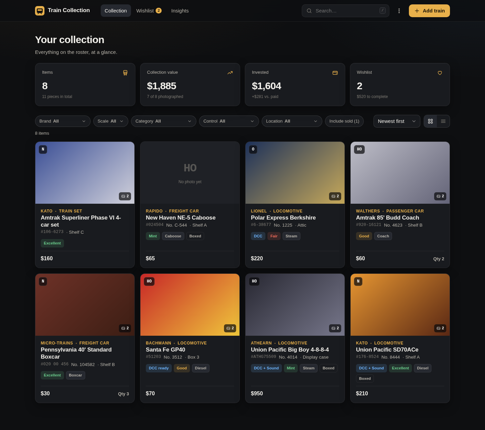
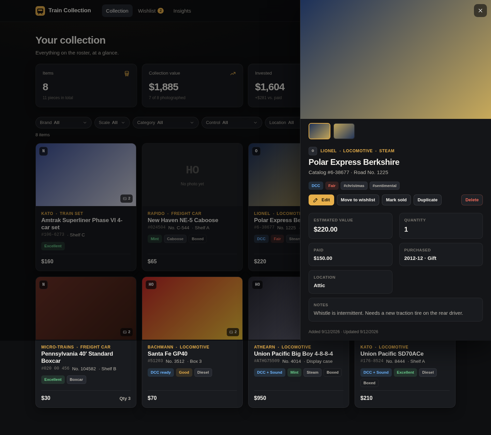
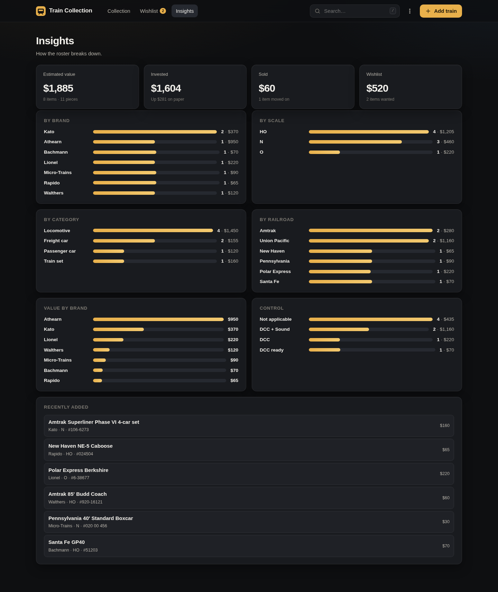
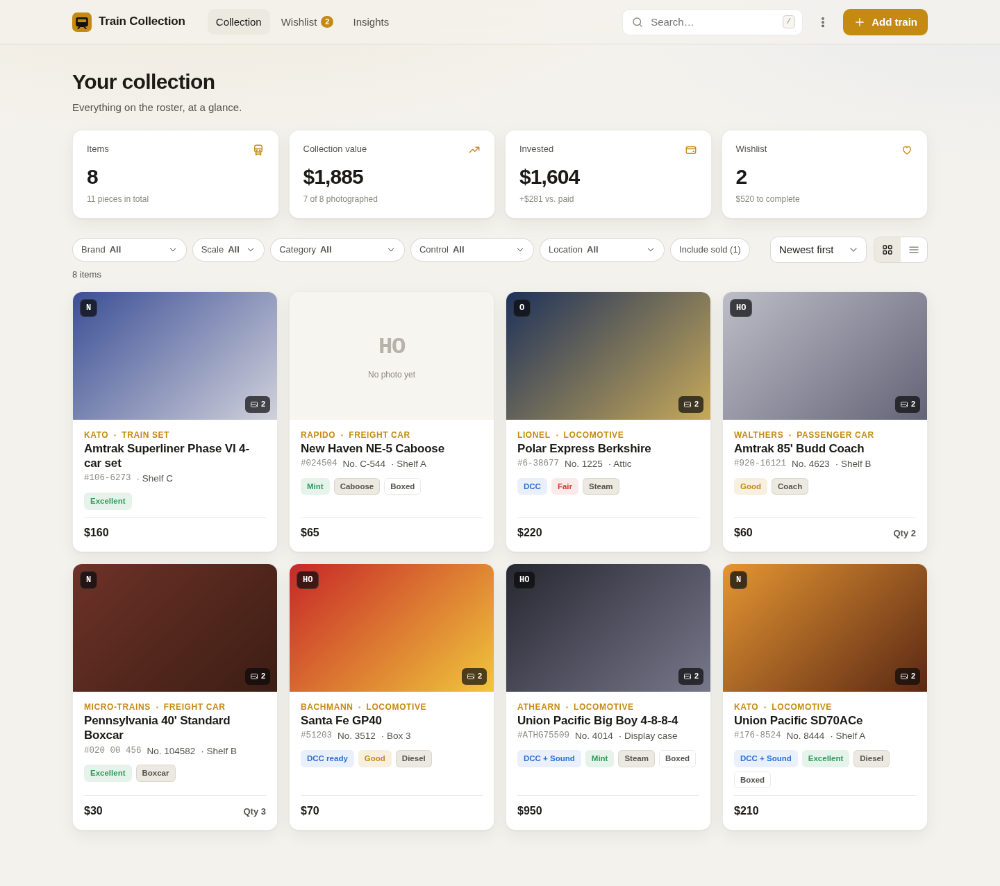

# Train Collection

A fast, lightweight, self-hosted tracker for your model train collection.
Runs entirely on your own machine, stores everything in one SQLite file, and has
no build step, no accounts, and no cloud.



## What it does

- **Catalogue every piece** with the fields collectors actually use: brand, scale,
  catalog number, model, railroad and road number, category (locomotive, freight
  car, passenger car, set, track, structure, accessory), type (diesel, steam,
  boxcar, caboose…), DC / DCC / DCC + sound, condition, quantity, original box,
  price paid, where and when you bought it, estimated value, storage location,
  tags and free-form notes.
- **Photos** — upload from disk (drag-and-drop works), or paste an image URL.
  Multiple photos per item, pick a cover photo, gallery in the detail view.
- **Collection, wishlist and sold** — move items between the three with one
  click. "Got it!" turns a wishlist entry into a collection entry.
- **Search, filter and sort** — instant full-text search across every field,
  filter chips for brand, scale, category, control and location, seven sort
  orders, grid or list layout.
- **Dashboard and insights** — item and piece counts, estimated value, money
  invested, gain on paper, and breakdowns by brand, scale, category, railroad
  and control system.
- **Backup and export** — one-click JSON backup (and restore, merge or
  replace), plus CSV export for spreadsheets.
- **Dark and light themes**, keyboard shortcuts (`/` search, `n` new item,
  `Esc` close), and a layout that works on an iPad or phone on your home
  Wi-Fi as well as on the Mac.

| Detail drawer | Insights | Light theme |
| --- | --- | --- |
|  |  |  |

## Requirements

- **Node.js 22.13 or newer** (Node 24 is fine). That's it. SQLite is built into
  Node, so there is nothing to compile and no database server to run.
- The only npm dependency is [Express](https://expressjs.com/) (MIT licensed).

## Install on an M4 Mac mini

1. Install Node.js if you don't have it. The easiest way is
   [Homebrew](https://brew.sh/):

   ```sh
   brew install node
   node --version   # should print v22.13 or higher
   ```

   (You can also download the macOS installer from <https://nodejs.org/>.)

2. Get the code and install the one dependency:

   ```sh
   git clone https://github.com/robertherrera/Collector.git
   cd Collector
   npm install
   ```

3. Start it:

   ```sh
   npm start
   ```

4. Open <http://localhost:4400> in Safari, Chrome or Brave. That's the whole
   setup. Press **Add train** to add your first item.

To stop the app press `Ctrl+C` in the Terminal window.

## Where your data lives

Everything is stored in the `data/` folder next to the app:

```
data/
├── train-collection.db  # the SQLite database (all items, photo records)
└── uploads/             # photos you uploaded
```

To back up, copy that folder, or use **⋮ → Download JSON backup** in the app.
The `data/` folder is ignored by git so it never gets committed by accident.

You can point the app somewhere else, for example an external drive or iCloud
folder, with an environment variable:

```sh
TRAIN_COLLECTION_DATA_DIR="$HOME/Documents/Train Collection" npm start
```

## Optional: run it in the background and at login

If you'd like Train Collection to always be running on the Mac mini, use
[pm2](https://pm2.keymetrics.io/) (MIT licensed):

```sh
npm install -g pm2
pm2 start server.js --name train-collection --node-args="--disable-warning=ExperimentalWarning"
pm2 save
pm2 startup      # prints one command to run so pm2 starts at login
```

Then `pm2 logs train-collection` shows the log, `pm2 stop train-collection` stops it.

## Optional: reach it from your iPad or phone

By default the app only listens on the Mac itself. To open it from other
devices on your home network, bind to all interfaces:

```sh
HOST=0.0.0.0 npm start
```

Then browse to `http://<your-mac-mini-name>.local:4400` from another device.
There is no login, so only do this on a network you trust.

## Configuration

| Variable | Default | What it does |
| --- | --- | --- |
| `PORT` | `4400` | Port to listen on |
| `HOST` | `127.0.0.1` | Interface to bind; use `0.0.0.0` for LAN access |
| `TRAIN_COLLECTION_DATA_DIR` | `./data` | Where the database and uploads are stored |

## Development

```sh
npm run dev    # restarts automatically when server files change
npm test       # runs the API test suite (node:test, no extra tooling)
```

The layout is deliberately small:

```
server.js          Express server: JSON API, photo uploads, static files
src/db.js          SQLite schema, validation, queries, stats, import/export
public/index.html  Single-page UI
public/styles.css  Styling (dark + light themes)
public/app.js      Front-end logic, no framework, no build step
test/api.test.js   End-to-end API tests
```

### API

All endpoints return JSON.

| Method | Path | Purpose |
| --- | --- | --- |
| `GET` | `/api/items` | All items with their photos |
| `POST` | `/api/items` | Create an item |
| `GET` / `PUT` / `DELETE` | `/api/items/:id` | Read, update (partial OK), delete |
| `POST` | `/api/items/:id/photos` | Upload a photo: raw image bytes, `Content-Type: image/*` |
| `POST` | `/api/items/:id/photos/url` | Attach an external image `{ "url": "https://…" }` |
| `PUT` | `/api/items/:id/photos/:pid/primary` | Make a photo the cover |
| `DELETE` | `/api/items/:id/photos/:pid` | Remove a photo |
| `GET` | `/api/stats` | Totals and breakdowns |
| `GET` | `/api/export.json` | Full backup |
| `GET` | `/api/export.csv` | Spreadsheet export |
| `POST` | `/api/import?mode=merge\|replace` | Restore a backup |

## License

MIT. See [LICENSE](LICENSE).
